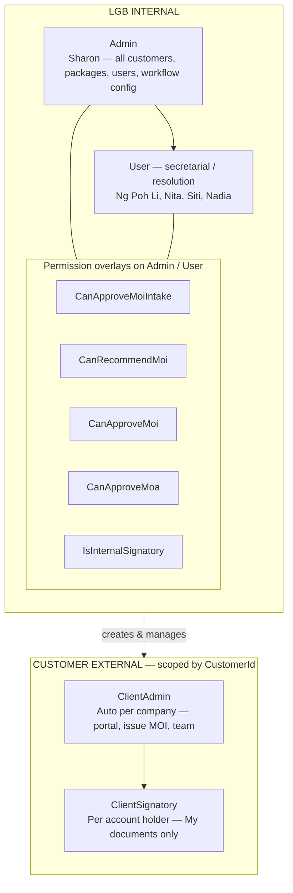
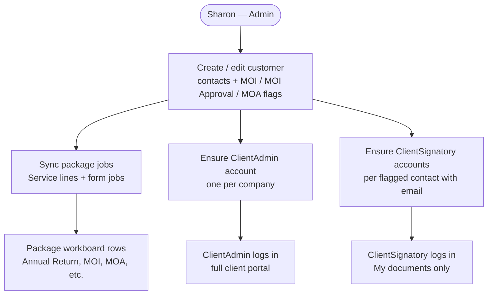
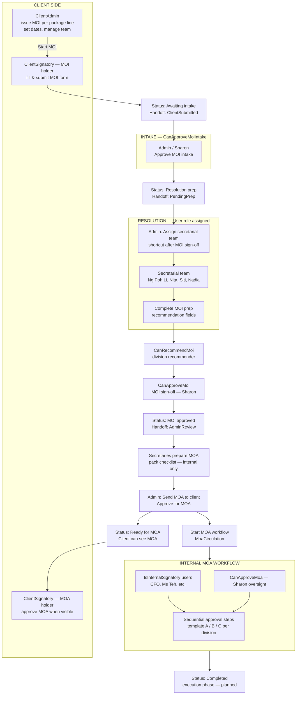
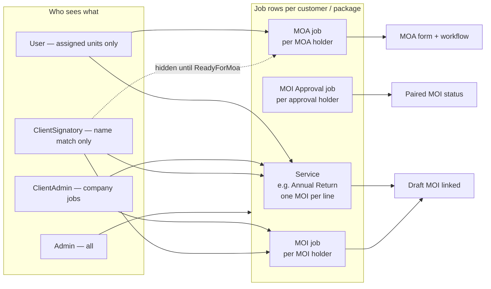
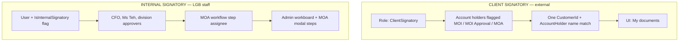

# User roles, hierarchy & system flow

LGB Services has **4 active login roles**. Internal users can also have **permission flags** and **`IsInternalSignatory`** — overlays on `Admin` / `User`, not separate roles.

**Full document (PDF):** [USER_ROLES.pdf](./USER_ROLES.pdf)  
**Enlarged flowcharts only (PDF):** [USER_ROLES_FLOWCHARTS.pdf](./USER_ROLES_FLOWCHARTS.pdf)  
**Regenerate PDFs:** `python3 docs/build-user-roles-pdf.py` (from repo root)

---

## 1. Active roles (4)

| # | Role | Side | Scoped to | Typical UI |
|---|------|------|-----------|------------|
| 1 | **Admin** | LGB internal | All customers | Dashboard, customers, packages, admin, workflow config |
| 2 | **User** | LGB internal | Jobs assigned to them | My work tracker, assigned package lines, forms |
| 3 | **ClientAdmin** | Customer external | One `CustomerId` | Client portal, packages, team & signatories |
| 4 | **ClientSignatory** | Customer external | One company + their name on forms | **My documents** only |

**Legacy:** `Client` → migrated to `ClientAdmin` on startup (not used for new accounts).

---

## 2. Role hierarchy



### Access ladder (high → low)

```
Admin (internal)
  └── User (internal secretary)        ← assigned per job; prep MOI/MOA
        └── [+ permission flags]       ← intake, recommend, MOI/MOA sign-off
        └── [+ IsInternalSignatory]    ← named MOA workflow step approver

──────────── customer boundary ────────────

ClientAdmin (external)                 ← one company; full client portal
  └── ClientSignatory (external)       ← one company; only their forms
```

---

## 3. Internal permission overlays

| Flag | Who typically | What it does |
|------|----------------|--------------|
| `CanApproveMoiIntake` | Sharon, named intake approvers | Approve client-submitted MOI → resolution can start |
| `CanRecommendMoi` | Division recommenders (matrix) | Recommend MOI after secretary prep |
| `CanApproveMoi` | Sharon | Final internal MOI sign-off |
| `CanApproveMoa` | Sharon | Oversight on MOA workflow (sees MOA before wide assignment) |
| `IsInternalSignatory` | CFO, Ms Teh, etc. | Named approver on **internal** MOA workflow steps |

Configured in **Admin → Users** and **Admin → Workflow config** (link user to MOA template step).

---

## 4. Customer onboarding (who gets an account)



| Trigger | Account created | Role |
|---------|-----------------|------|
| Customer saved | 1× company admin | `ClientAdmin` |
| Contact flagged MOI / MOI Approval / MOA + email | 1× per contact | `ClientSignatory` |
| ClientAdmin adds signatory (Team tab) | Holder + login | `ClientSignatory` (marked **Client-added**) |
| Admin creates user | Manual | Any of 4 roles |

---

## 5. End-to-end MOI/MOA pipeline (roles at each step)

This is the **implemented** flow today. Steps marked *planned* are not built yet.



### Step-by-step (role column)

| Step | Display status (examples) | Handoff | Primary role(s) |
|------|---------------------------|---------|-----------------|
| Package synced | MOI not received | — | **Admin** (Sharon) creates customer |
| Client starts MOI | Awaiting intake | `ClientSubmitted` | **ClientAdmin** issues; **ClientSignatory** fills |
| Intake approved | Resolution prep | `PendingPrep` | **CanApproveMoiIntake** |
| Secretary works MOI | Resolution prep → Pending recommendation | `ResoInProgress` | **User** (assigned) |
| Recommended | MOI sign-off | — | **CanRecommendMoi** |
| MOI signed off | MOI approved | `AdminReview` | **CanApproveMoi** |
| MOA pack prep | MOI approved / internal | `AdminReview` | **User** via **Assign secretarial team** |
| Sent to client | Ready for MOA | `ReadyForMoa` | **Admin** — Approve for MOA |
| Client MOA | MOA circulation | `MoaCirculation` | **ClientSignatory** (MOA holder) |
| Internal MOA chain | MOA circulation | `MoaCirculation` | **IsInternalSignatory** + **CanApproveMoa** |
| Done | Completed | `Completed` | — |

---

## 6. Job types & who sees them



| Job `TaskType` | Purpose | ClientAdmin | ClientSignatory | User (secretary) |
|----------------|---------|-------------|-----------------|------------------|
| `Service` | Package deliverable (e.g. Annual Return) | Issue/open MOI | Start/open own MOI | If assigned |
| `MOI` | Form job per MOI holder | Company view | Own forms | If assigned |
| `MOI Approval` | Parallel approval track | Hidden on portal | *thin UX* | Internal board |
| `MOA` | MOA per MOA holder | After Ready for MOA | After Ready for MOA | Prep before client send |

---

## 7. Display status lifecycle

```mermaid
stateDiagram-v2
  direction LR

  [*] --> MoiNotReceived: Service line synced
  MoiNotReceived --> AwaitingIntake: Client issues MOI
  AwaitingIntake --> ResolutionPrep: Intake approved
  ResolutionPrep --> PendingRecommendation: Secretary prep
  PendingRecommendation --> MoiSignOff: Recommended
  MoiSignOff --> MoiApproved: MOI sign-off
  MoiApproved --> MoaPrepInternal: Assign secretarial team
  MoaPrepInternal --> ReadyForMoa: Approve for MOA
  ReadyForMoa --> MoaCirculation: Start MOA workflow
  MoaCirculation --> Completed: Workflow complete
  Completed --> [*]
```



---

## 8. Client vs internal signatory



| | Client signatory | Internal signatory |
|--|------------------|-------------------|
| **Role** | `ClientSignatory` | `User` (+ optional flags) |
| **Flag** | — | `IsInternalSignatory` |
| **MOI** | Fill/submit as holder | Prep when assigned |
| **MOA** | Approve when sent to client | Approve workflow steps before/during circulation |
| **Portal** | My documents | Internal workboard |

---

## 9. Seed / example accounts

| Person | Role | Flags |
|--------|------|-------|
| Sharon | Admin | Intake, Recommend, MOI sign-off, MOA sign-off |
| Ng Poh Li, Nita, Siti, Nadia | User | — (assigned only) |
| `{company} Admin` | ClientAdmin | Auto per customer |
| MOI/MOA contacts | ClientSignatory | Auto from account holders |
| CFO, Ms Teh, … | User | `IsInternalSignatory` + workflow step link |

---

## 10. Summary

- **4 roles:** `Admin`, `User`, `ClientAdmin`, `ClientSignatory`
- **2 sides:** LGB internal vs customer external (`CustomerId` boundary)
- **5 internal overlays:** intake, recommend, MOI sign-off, MOA oversight, internal MOA signatory
- **Client never sees MOA** until **Ready for MOA** (after Sharon approves for MOA)
- **Secretarial shortcut:** after MOI sign-off, **Assign secretarial team** adds all resolution `User` accounts to the job + MOA row

---

## Code references

| Area | Path |
|------|------|
| Roles | `LGBApp.Backend/Models/UserRoles.cs` |
| User flags | `LGBApp.Backend/Models/User.cs` |
| Handoff states | `LGBApp.Backend/Services/JobHandoffService.cs` |
| Status labels | `LGBApp.Backend/Services/PackageItemStatusResolver.cs` |
| Secretarial assign | `LGBApp.Backend/Services/JobRequestAssignmentService.cs` |
| Client signatory provision | `LGBApp.Backend/Services/CustomerSignatoryProvisioner.cs` |
| Frontend roles | `LGBApp.Frontend/src/lib/roles.ts` |
